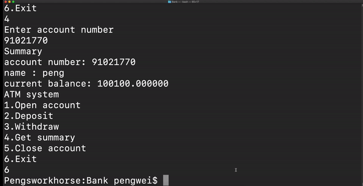

# ATM system

This is a maven project that used to practice the singleton and template design pattern.
It mimic a simple ATM system have the following funtions:
- open account
- deposit
- withdraw
- get the statement
- close the account.



### Requirement

```
maven >3.0.0
java > 8.0
```

### Test
There is 7 tests:

Test the Bank is singleton and can open and close account
```
mvn test -Dtest=BankTest test
```

Test the account can print the statement
```
mvn test -Dtest=AccountTest test
```

Test the checking account has interest rate of 0
```
mvn test -Dtest=CheckingAccountTest test
```

Test the saving account has positive interest rate
```
mvn test -Dtest=SavingAccountTest test
```

Run all test
```
mvn test
```

### Build

```
mvn clean package
```

The .jar file is at `target/Bank-1.0-SnapShot.jar`

### Run

```
java -cp target/Bank-1.0-SnapShot.jar com.lab1.App
```

